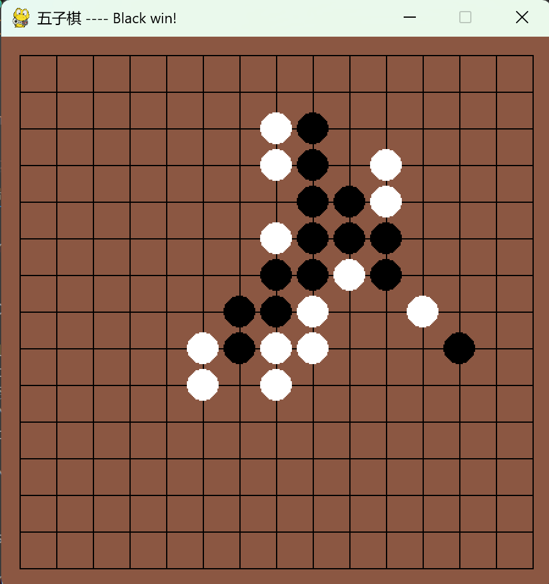

# 
五子棋--博弈树搜索 Alpha-beta 剪枝

## 效果展示

## 算法原理

**Alpha-beta 剪枝**
Alpha-beta 剪枝算法是在极小化极大（Minimax）算法的基础上发展而来的。Minimax算法是一种在零和游戏中寻找最优策略的算法，它通过递归地搜索游戏树来评估可能的走法和结果。然而，Minimax 算法可能会搜索整个游戏树，这在复杂的游戏中会导致巨大的计算量。为了解决这个问题，alpha-beta 剪枝算法被提出，其核心思想是通过剪掉那些明显不会影响最终决策的分支来减少搜索的节点数。

算法传入棋盘的列表，当前的 alpha 和 beta 值。

**算法优化**
算法维护当前棋盘真正落子的边界，这基于一个观察，对当前棋盘来说，有效的落子仅仅分布在有棋子的附近，因此远离棋子边界的落子不予考虑。

例如，对当前棋盘的状态，黑白棋子仅在中心 5*5 的范围内，那么只需考虑中心 6*6 的范围落子，有效剪枝。那么结合 Alpha-Beta 剪枝和落子边界剪枝的双剪枝算法能有效提升算法的效率。具体体现在，未优化前搜索深度最大只能确定为 2，如果设置为 3，计算过程极为缓慢；优化后可以在 30s-1min 内运行深度为 3 的搜索，提升落子质量。

## 代码运行
`python gobang.py --chess_file filename`